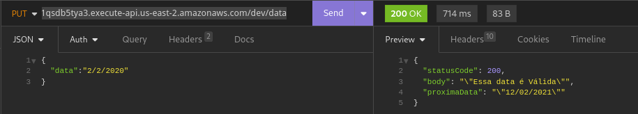

# Desafio Adapcon: Desenvolvimento de uma API

## Funcionamento da API
A API requer uma requisição com formato JSON, conforme o exemplo abaixo:
```json
{
  "data":"12/02/2021"
}
```

### Observação:
O formato de datas utilizado pela API é DD/MM/YYYY.

Exemplos válidos:
```json
"data":"02/02/2020"
```
ou
```json
"data":"2/2/2020"
```


É possível realizar uma requisição à API através da seguinte URL:
[https://1qsdb5tya3.execute-api.us-east-2.amazonaws.com/dev/data](https://1qsdb5tya3.execute-api.us-east-2.amazonaws.com/dev/data)

A requisição deve ser realizada com o método "PUT", conforme demonstrado abaixo:



## Links de Referência
### Serverless
* [https://www.serverless.com](https://www.serverless.com)

### Amazon Web Services
* [https://aws.amazon.com/api-gateway/](https://aws.amazon.com/api-gateway/)
* [https://docs.aws.amazon.com/lambda/latest/dg/welcome.html](https://docs.aws.amazon.com/lambda/latest/dg/welcome.html)

### JavaScript
* [https://developer.mozilla.org/en-US/docs/Web/JavaScript](https://developer.mozilla.org/en-US/docs/Web/JavaScript)

### Artigos sobre o assunto:
* [https://www.cnnbrasil.com.br/tecnologia/22-2-22-entenda-o-que-e-uma-data-palindromo/](https://www.cnnbrasil.com.br/tecnologia/22-2-22-entenda-o-que-e-uma-data-palindromo/)
* [https://www.youtube.com/watch?v=FaybjGx3uQI](https://www.youtube.com/watch?v=FaybjGx3uQI)
* [https://www.youtube.com/watch?v=ktH_HhQDgLY&t=365s](https://www.youtube.com/watch?v=ktH_HhQDgLY&t=365s)

## Softwares Utilizados
* Node.js - (v20.8.1 - Fedora 39)
* Serverless - (3.37.0 - npm)
* AWS - Amazon Web Services - (free trial)

Última atualização : 19/11/2023